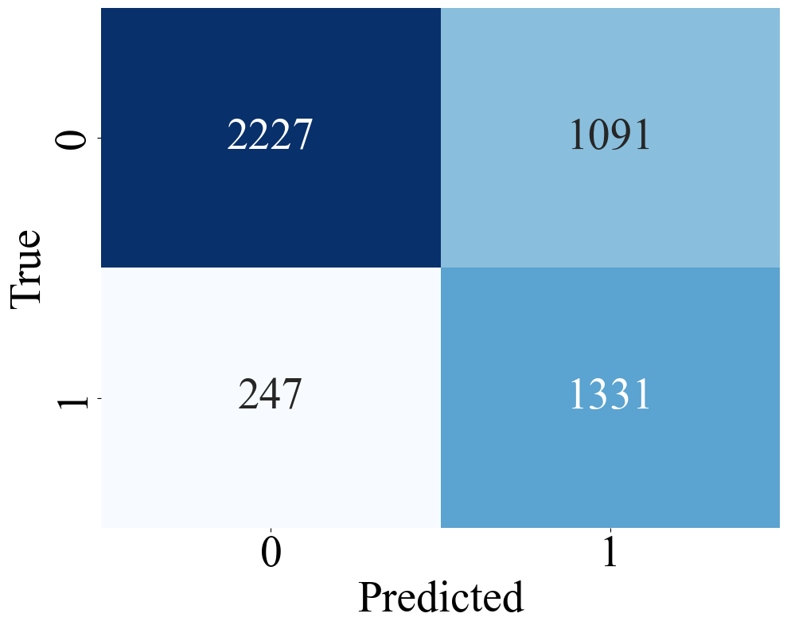
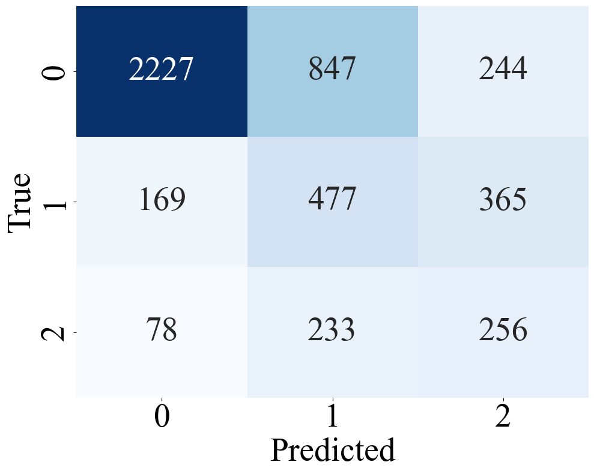
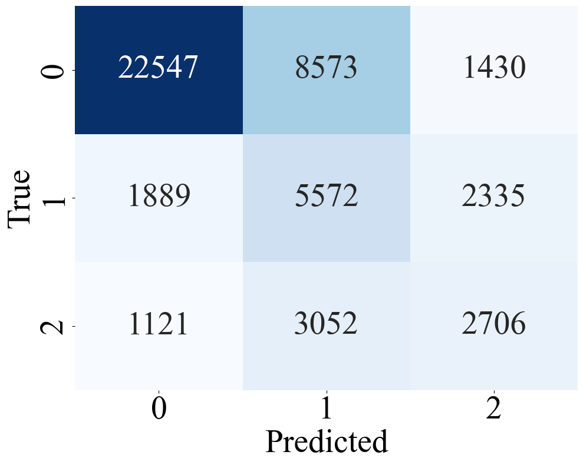
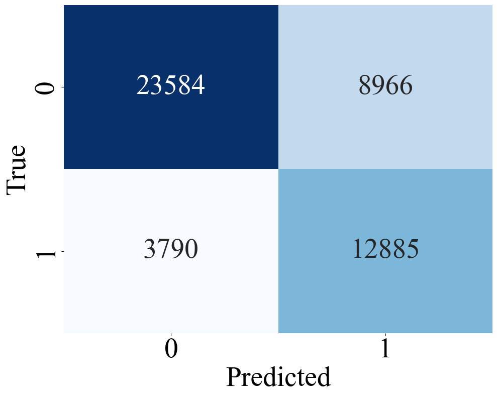
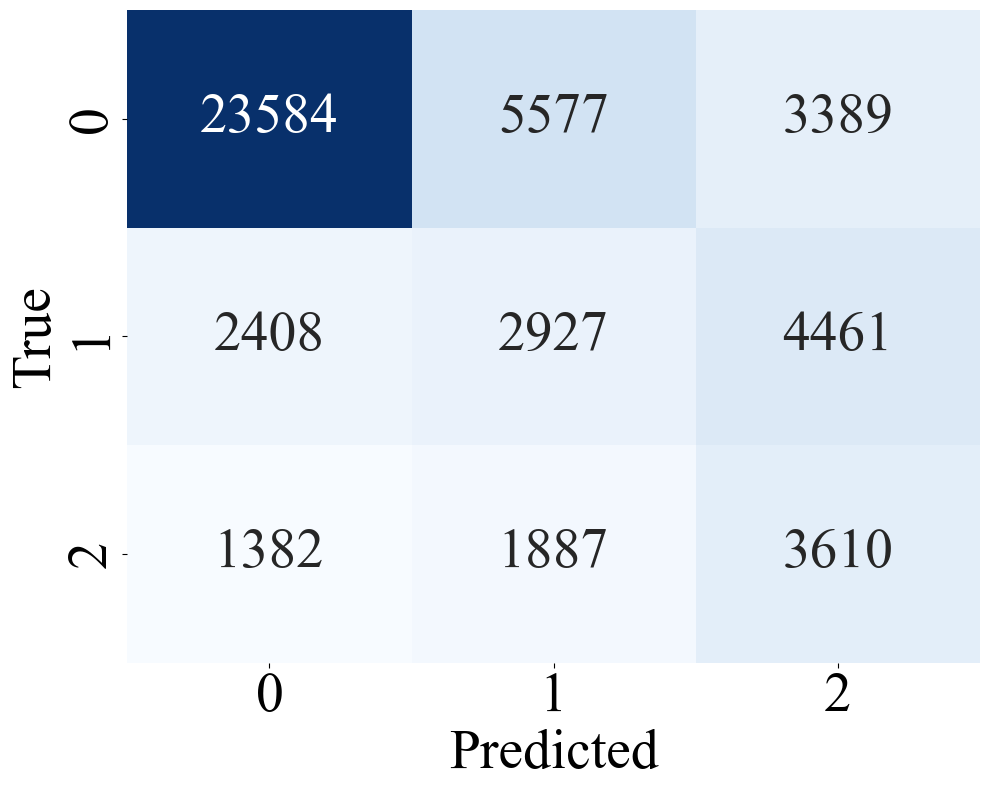
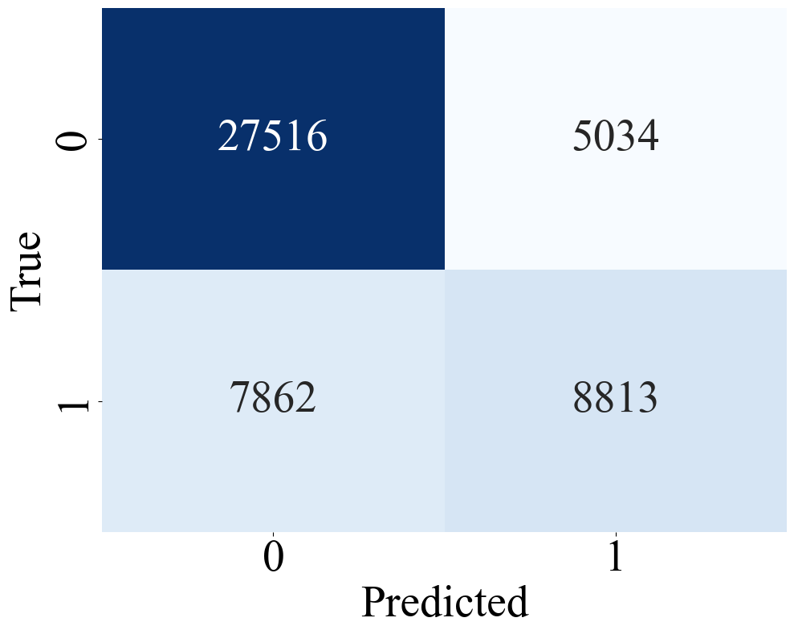
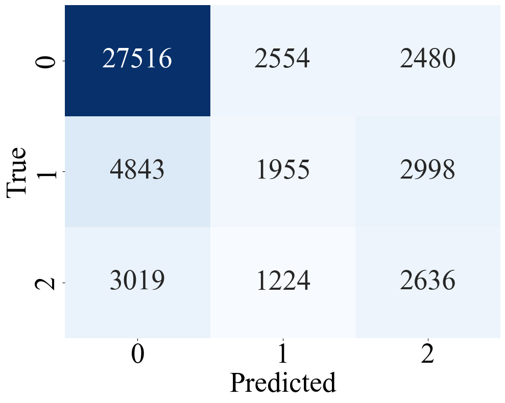
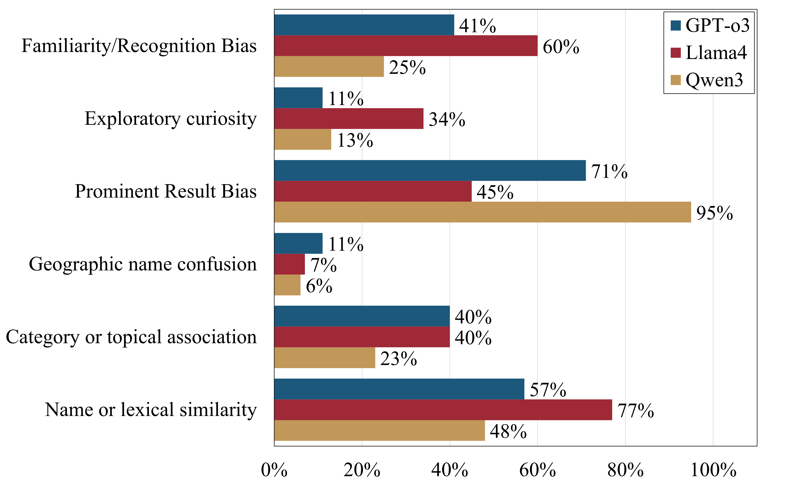

# ClickLLM
This repository contains the code and extended results for our paper "LLM-as-a-Judge in Entity Retrieval: Assessing Explicit and Implicit Relevance"

## Main Results
Comparing LLM-based relevance judgments to human annotations on DBpedia-Entity.
### Figure 1: Llama Model Evaluations

<table>
  <tr>
    <td align="center"><br><b>Abstract Binary</b></td>
    <td align="center"><br><b>Abstract Graded</b></td>
    <td align="center"><br><b>Title Binary</b></td>
    <td align="center"><br><b>Title Graded</b></td>
  </tr>
</table>

### Figure 2: Qwen Model Evaluations

<table>
  <tr>
    <td align="center"><br><b>Abstract Binary</b></td>
    <td align="center"><br><b>Abstract Graded</b></td>
    <td align="center"><br><b>Title Binary</b></td>
    <td align="center"><br><b>Title Graded</b></td>
  </tr>
</table>

### Figure 3: LLM Click-through Reason Assignment Results

Distribution of LLM-generated reasons for user clicks on entities judged irrelevant. Prominent result bias and lexical similarity are the most frequent factors.

<p align="left">
  
</p>

## Repository Structure

```
ClickLLM/
├── assets/        # Figures and images used in documentation and results
├── data/          # Datasets, queries, qrels, and supporting data files
├── outputs/       # Output results from LLM judgments and reasoning
│   ├── llm_qrel/      # LLM-generated relevance judgments
│   │   ├── dbpedia/   # Judgments for DBpedia dataset
│   │   └── laque/     # Judgments for LaQuE dataset
│   └── llm_reasoning/ # LLM-generated reason assignments
└── src/           # Source code for scripts and analysis
    ├── dbpedia_judgement.py         # Runs LLM-based relevance judgments on DBpedia-Entity, comparing entity titles and abstracts for each query-entity pair
    ├── laque_judgement.py           # Applies LLM-based relevance judgments to the LaQuE dataset, supporting multiple years/collections and both positive and negative entity samples
    ├── laque_analysis.py            # Analyzes and distills the reasons why users clicked on entities deemed irrelevant, generating a conceptual list of atomic reasons per query-entity pair using LLMs
    └── laque_analysis_assigner.py   # Assigns binary labels for each query-entity pair and reason, determining if the LLM thinks a specific reason applies to the user's click behavior
```

### Contents of `src/` directory

- **dbpedia_judgement.py**: Runs LLM-based relevance judgments on DBpedia-Entity, comparing entity titles and abstracts for each query-entity pair.
- **laque_judgement.py**: Applies LLM-based relevance judgments to the LaQuE dataset, supporting multiple years/collections and both positive and negative entity samples.
- **laque_analysis.py**: Analyzes and distills the reasons why users clicked on entities deemed irrelevant, generating a conceptual list of atomic reasons per query-entity pair using LLMs.
- **laque_analysis_assigner.py**: Assigns binary labels for each query-entity pair and reason, determining if the LLM thinks a specific reason applies to the user's click behavior.


## Tabular Results

### Table 1: Example queries and relevance judgments from DBpedia-Entity

| Query                        | Entity                                                                                  | LLM | Human |
|-----------------------------|------------------------------------------------------------------------------------------|-----|--------|
| *Einstein Relativity theory* | [Theory of Relativity](https://dbpedia.org/page/Theory_of_Relativity)                   | 2   | 2      |
| *Disney Orlando*            | [Greater Orlando](https://dbpedia.org/page/Greater_Orlando)                             | 1   | 0      |
| *Austin Texas*              | [Texas](https://dbpedia.org/page/Texas)                                                 | 0   | 1      |
| *Guitar Classical Bach*     | [Johann Sebastian Bach](https://dbpedia.org/page/Johan_Sebastian_Bach)                  | 2   | 0      |

---

### Table 2: Example queries from the LaQuE dataset with clicked entities and LLM judgments

| Query                          | Clicked Entity                                                                 | LLM Judgment  |
|--------------------------------|--------------------------------------------------------------------------------|---------------|
| *Apple Mac*                    | [Macintosh](https://dbpedia.org/page/Macintosh)                                | Relevant      |
| *Indian History in Hindi*      | [Hindi](https://dbpedia.org/page/Hindi)                                        | Not Relevant  |
| *CNN News Cast Members*        | [List of CNN Anchors](https://dbpedia.org/page/List_of_cnn_anchors)            | Relevant      |
| *When Was Color Invented*      | [Color television](https://dbpedia.org/page/Color_television)                  | Not Relevant  |

---

### Table 3: Cohen’s κ scores for binary and graded LLM judgments from DBpedia-Entity

| Input                 | Binary   | Graded   |
|----------------------|----------|----------|
| *Titles*             | 0.3900   | 0.2733   |
| *Titles + Abstracts* | 0.4623   | 0.3042   |

---

### Table 4: Agreement between LLM relevance judgments and click-through data on 15k queries

| Input                 | # Agreements | Accuracy   |
|----------------------|--------------|------------|
| *Titles*             | 14,910       | 91.93%     |
| *Titles + Abstracts* | 14,888       | 91.79%     |

---

### Table 5: Example LaQuE queries with clicked entities and LLM click-through reasoning

| Query                    | Clicked Entity                                                                 | LLM Reasoning                                                                                   |
|--------------------------|--------------------------------------------------------------------------------|--------------------------------------------------------------------------------------------------|
| *X Factor USA Judges*    | [The X Factor (UK TV series)](https://dbpedia.org/page/The_X_Factor_(British_TV_series))     | Name or lexical similarity, Prominent Results Bias                                              |
| *Palm Springs Florida*   | [Palm Springs, California](https://dbpedia.org/page/Palm_Springs,_California)              | Name or lexical similarity, Geographic name confusion                                           |
| *Brad Pitt Vegan*        | [List of vegans](https://dbpedia.org/page/list_of_vegans)                                  | Category or topical association, Prominent Result Bias, Exploratory curiosity                   |
| *John Bundy*             | [Ted Bundy](https://dbpedia.org/page/Ted_Bundy)                                            | Name or lexical similarity, Prominent Result Bias, Exploratory curiosity, Familiarity Bias      |

## Scripts
Our project files consist of three stages: Relevance Judgement, Reason Nuggetization, and Label Assignment
### Relevance Judgement

#### Dbpedia
The script ``gold_standard_abstract_graded.py`` prompts an LLM of choice ``Qwen3:8b`` or ``LLama4:Scout`` to perform a judgement task on Dbpedia query-entity pairs.
The ``use_abstract`` flag determines whether the script uses **entity titles** or **entity abstracts** for the judgement task.

#### LaQuE
The script ``laque_graded.py`` prompts an LLM of choice ``Qwen3:8b`` or ``LLama4:Scout`` to perform a judgement task on LaQuE query-entity pairs.

### Reason Nuggetization
The ``laque_analysis.py`` prompts an LLM of choice ``Qwen3:8b`` or ``LLama4:Scout`` to perform an analysis of the reasons why users have clicked on the entity despite irrelevance to the query as determined by LLM.
The LLM will produce a separate list of reasons for each query-entity pair, which we will then aggregate to 6 general distilled reasons.

### Label Assignment
Once the reasons are generated, run ``laque_analysis_assigner.py`` to assign a binary value of 0 or 1 for each query-entity pair depending on whether the LLM thinks the corresponding list item is an applicable reason for the user clicking on the entity.

## Prompt
```
Given a query and the abstract of a knowledge entit you must choose one option:\n"
  0: The entity seems irrelevant to the query.\n"
  1: The entity seems relevant to the query but does not directly match it.\n"
  2: The entity seems highly relevant to the query or is an exact match.\n\n"
Break down each query into these steps:\n"
  1. Consider what information the user is likely searching for with the query.\n"
  2. Measure how well the abstract matches a likely intent of the query (M), scored 0–2.\n"
  3. Assess whether the entity matches any reasonable interpretation of the query (I), scored 0–2.\n"
  4. Based on M and I, decide on a final score (O), scored 0–2.\n"

"Query: {}\n"
"Entity: {}\n"
"IMPORTANT: Your response must only be in the format of "Final score: #" \n"
"Relevant?"
 ```