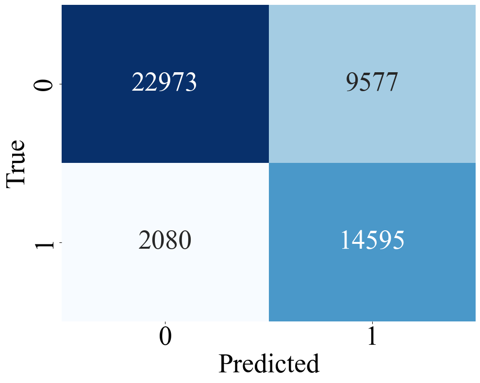

# ClickLLM
This repository contains the code and extended results for our paper "LLM-as-a-Judge in Entity Retrieval: Assessing Explicit and Implicit Relevance"

## Main Results
Comparing LLM-based relevance judgments to human annotations on DBpedia-Entity.
### Figure 1: Llama Model Evaluations

<table>
  <tr>
    <td align="center"><br><b>Abstract Binary</b></td>
    <td align="center"><br><b>Abstract Graded</b></td>
    <td align="center"><br><b>Title Binary</b></td>
    <td align="center"><br><b>Title Graded</b></td>
  </tr>
</table>

### Figure 2: Qwen Model Evaluations

<table>
  <tr>
    <td align="center"><br><b>Abstract Binary</b></td>
    <td align="center"><br><b>Abstract Graded</b></td>
    <td align="center"><br><b>Title Binary</b></td>
    <td align="center"><br><b>Title Graded</b></td>
  </tr>
</table>

### Figure 3: LLM Click-through Reason Assignment Results

Distribution of LLM-generated reasons for user clicks on entities judged irrelevant. Prominent result bias and lexical similarity are the most frequent factors.

<p align="left">
  
</p>


## Scripts
Our project files consist of three stages: Relevance Judgement, Reason Nuggetization, and Label Assignment
### Relevance Judgement

#### Dbpedia
The script ``gold_standard_abstract_graded.py`` prompts an LLM of choice ``Qwen3:8b`` or ``LLama4:Scout`` to perform a judgement task on Dbpedia query-entity pairs.
The ``use_abstract`` flag determines whether the script uses **entity titles** or **entity abstracts** for the judgement task.

#### LaQuE
The script ``laque_graded.py`` prompts an LLM of choice ``Qwen3:8b`` or ``LLama4:Scout`` to perform a judgement task on LaQuE query-entity pairs.

### Reason Nuggetization
The ``laque_analysis.py`` prompts an LLM of choice ``Qwen3:8b`` or ``LLama4:Scout`` to perform an analysis of the reasons why users have clicked on the entity despite irrelevance to the query as determined by LLM.
The LLM will produce a separate list of reasons for each query-entity pair, which we will then aggregate to 6 general distilled reasons.

### Label Assignment
Once the reasons are generated, run ``laque_analysis_assigner.py`` to assign a binary value of 0 or 1 for each query-entity pair depending on whether the LLM thinks the corresponding list item is an applicable reason for the user clicking on the entity.

## Prompt
```
Given a query and the abstract of a knowledge entit you must choose one option:\n"
  0: The entity seems irrelevant to the query.\n"
  1: The entity seems relevant to the query but does not directly match it.\n"
  2: The entity seems highly relevant to the query or is an exact match.\n\n"
Break down each query into these steps:\n"
  1. Consider what information the user is likely searching for with the query.\n"
  2. Measure how well the abstract matches a likely intent of the query (M), scored 0–2.\n"
  3. Assess whether the entity matches any reasonable interpretation of the query (I), scored 0–2.\n"
  4. Based on M and I, decide on a final score (O), scored 0–2.\n"

"Query: {}\n"
"Entity: {}\n"
"IMPORTANT: Your response must only be in the format of "Final score: #" \n"
"Relevant?"
 ```
